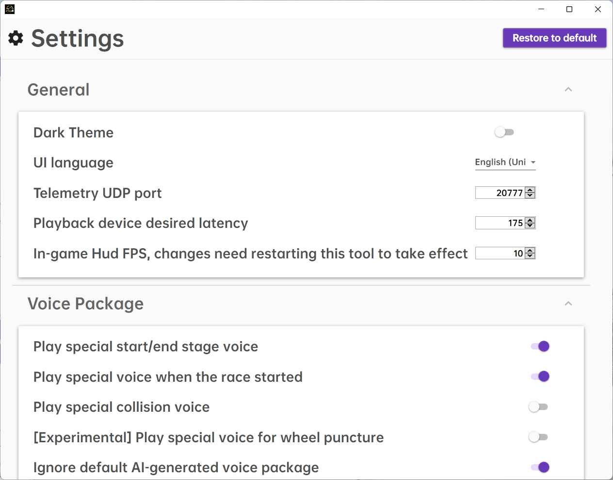

# ztmz_pacenote 🎉🎉🎉🎉🎉🎉🎉🎉🎉🎉🎉

Thanks for the efforts from the community, ZTMZ Club Pacenote Tool, which has all tracks' pacenotes customized was released since version 2.4.4.

PR and Issue are welcome !!!

#### Introduction
The pacenote tool from ZTMZ Club, can be used to customize the pacenotes in the game `Dirt Rally 2.0`，ZTMZ Club QQ Group：`207790761`; QQ Group for pacenotes recording & customization：`697673264`

#### Instruction
1. Download the executable installer __"ZTMZClub_PacenoteTool_Installer_x.y.z.exe"__ from [Link](https://gitee.com/ztmz/ztmz_pacenote/releases)  and double click it to install.
2. During the installation, it will download and install `dotnet6` runtime for you in case of no `dotnet6` on you machine. A UAC window would prompt before `dotnet6` installation, just click "OK" to let it continue.
3. Start the game `Dirt Rally 2.0`
4. Turn off the default codriver calls in the game (set `Speech` to `0` in the `Audio` settings.)
5. Have fun with any rally track (RX not supported currently).

#### How to use with SIMHUB 
1. Change the listening UDP port in the "Settings" page (clicking the `Settings` button in the top-right of the main UI window).
2. Start `SIMHUB`，click `Game Settings` besides DR2.0 game.
3. check `UDP Forwarding`，and add a record forwarding to `127.0.0.1` and port `20778`.
4. Keep `SIMHUB` and `ZTMZClub Pacenote Tool` open, then start the game.
5. For `Dirt Rally Telemetry` just add one more record in `SIMHUB` forwarding to `127.0.0.1` and port `10001`.

#### Links
* Download：[releases](https://gitee.com/ztmz/ztmz_pacenote/releases)
* Pacenotes：[【腾讯文档】尘埃拉力赛2.0地图路书录制进程](https://docs.qq.com/sheet/DVVljT3dMWkpYSWdH)
* Pacenote tokens：[【腾讯文档】路书对照表](https://docs.qq.com/sheet/DVVlVZFdCWldkdXBi)

#### File Structure (located in `%userprofile%/Documents/My Games/ZTMZClub`)
* codrivers 
stores codriver audio packages, you can create your own (Any language) with [【腾讯文档】路书对照表](https://docs.qq.com/sheet/DVVlVZFdCWldkdXBi) and according to the format of other audio packages. Audio files in a named folder will be played randomly.
* lang
Multi-language support.
* profiles
stores the pacenotes (both scripts and pure audio pacenotes). You can create other folder besides the `default` folder for your own pacenotes group.
* Python38 (only for dev version)
Python38 environment
* speech_model (only for dev version)
Vosk speech recognition model, for automatically recording the pacenote from the game.

#### Modules
* OnlyR.Core
code for audio recording, from [AntonyCorbett/OnlyR](https://github.com/AntonyCorbett/OnlyR)
* ZTMZ.PacenoteTool
main project
* ZTMZ.PacenoteTool.Base
configuration, i18n, etc.
* ZTMZ.PacenoteTool.ScriptEditor
pacenote editor
* ZTMZ.PacenoteTool.AudioBatchProcessor
batch audio processor

#### Dependencies
* [Newtonsoft.Json](https://www.newtonsoft.com/json)
* [NAudio](https://github.com/naudio/NAudio)
* [PromptDialog](https://github.com/manuelcanepa/wpf-prompt-dialog)
* [AvalonEdit](http://avalonedit.net/)
* [WindowsAPICodePack-Shell](https://github.com/aybe/Windows-API-Code-Pack-1.1)
* [Vosk](https://alphacephei.com/vosk/)
* [GameOverlay.Net](https://github.com/michel-pi/GameOverlay.Net)
* [CoDriver-Splitter](https://github.com/CookiePLMonster/CoDriver-Splitter)
* [Material Design Xaml Toolkit](https://github.com/MaterialDesignInXAML/MaterialDesignInXamlToolkit)
* [Inno Setup](https://jrsoftware.org/isinfo.php)
* [Inno Setup Chinese Simplified Translation](https://github.com/kira-96/Inno-Setup-Chinese-Simplified-Translation)
#### References
* [CrewChiefV4](https://gitlab.com/mr_belowski/CrewChiefV4)
* [dr2_logger](https://github.com/ErlerPhilipp/dr2_logger)
* [Dirt Telemetry Tool](https://forums.codemasters.com/topic/9721-dirt-telemetry-tool-cortextuals-version/)

#### How to contribute
1. Fork the project
2. Install [.net 6.0 SDK](https://dotnet.microsoft.com/en-us/download/dotnet/thank-you/sdk-6.0.101-windows-x64-installer)
3. Use visual studio 2022 or JetBrains Rider to open `ZTMZ.PacenoteTool.sln` in the root directory of the project.
4. Make modifications and tests, create PR.

#### Thanks
* __小贤少少__ : contribution to the club
* __Meeke777__ : the idea of the tool
* __Greened U幻想最初__ : collection of the pacenote tokens
* __Bigboxx__ : advices to the tool and making audio packages  
* __圣沙蒙VK__ : recording audio packages and pure audio pacenote recording
* __紫藤林沫__ : recording audio packages
* __拉稀车手老王__ : recording and making of the audio packages
* __权威Authority__: recording and making of the audio packages
* __wha1ing__: recording and making of the audio packages
* __hippopo__: recording and making of the audio packages, proofreading of pacenote scripts
* __大李子小妖__: recording and making of the audio packages
* __\[Pacenotes recording\]__:
    * HanXu
    * 回家的誘いをかける
    * 栗悟饭とカメハメ波
    * Meeke777
    * O.Z. (Gliese-436b)
    * Silenig
    * smoke (DR2略略略)
    * Hippopo
    * Zexx
