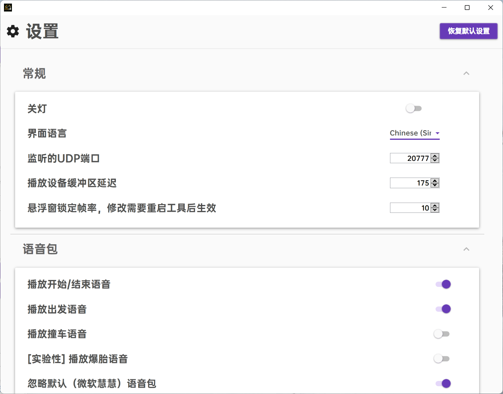

# ztmz_pacenote 🎉🎉🎉🎉🎉🎉🎉🎉🎉🎉🎉

感谢大家的努力，路书工具2.4.4目前已经收录了所有的路书脚本！！！啊，说着寒假再来搞2.5版本，结果还是提前发了。。。这下真的等到寒假再回来了，不然毕不了业了。。。

目前基本能用，后续个人会比较忙，寒假的时候再回来更新了哈哈哈哈哈哈。具体可参见[更新计划](#plan) 可能存在一些问题，欢迎提PR和Issue

#### 简介
ZTMZ车队路书工具，可以录制和播放Dirt Rally 2.0游戏的路书，车队QQ群：207790761，路书录制交流群：697673264

#### 白嫖指南 (安装过程请保持网络处于连接状态)
1. 通过[下载地址](https://gitee.com/ztmz/ztmz_pacenote/releases)下载最新版的名为 __"ZTMZClub_PacenoteTool_Installer_x.y.z.exe"__ 的安装文件双击安装
2. 安装期间如果检测到系统中未安装`dotnet6`运行时，安装程序会自动下载并安装，可能会弹出UAC提示框，点击“是”即可
3. 打开游戏
4. 在游戏设置的语音选项(Audio)中关掉原版的路书声音(Speech选项拖到最左边)
5. 进入计时赛选择目前支持的地图(参见[【腾讯文档】尘埃拉力赛2.0地图路书录制进程](https://docs.qq.com/sheet/DVVljT3dMWkpYSWdH))
6. 开始体验

#### 如何和simhub一起使用 
1. 在本工具右上角的设置界面里把UDP端口修改为20778
2. 打开`simhub`，选择DR2游戏并点击右侧的`游戏设置`
3. 在`UDP Forwarding`(端口转发)那里前面的勾勾选上，并添加一条转发到`127.0.0.1`的`20778`端口的设置（如果已经存在，就只需要勾选上前面的勾即可）
4. 保持simhub处于开启状态，启动本工具即可
5. 本步骤对于想要同时使用其他的工具也适用，比如`Dirt Rally Telemetry`工具，它默认监听`10001`端口，只需在`simhub`里再添加一条转发到`127.0.0.1`的`10001`端口的记录就行

#### 各种链接
* 下载地址：[releases](https://gitee.com/ztmz/ztmz_pacenote/releases)
* 路书录制进度：[【腾讯文档】尘埃拉力赛2.0地图路书录制进程](https://docs.qq.com/sheet/DVVljT3dMWkpYSWdH)
* 路书标记对照表：[【腾讯文档】路书对照表](https://docs.qq.com/sheet/DVVlVZFdCWldkdXBi)
* 视频
    - [版本通用使用教程](https://www.bilibili.com/video/BV1oq4y1u7ua/) (置顶评论有进度条)
    - [\[2021-08-29 直播录像\]\[尘埃拉力赛2.0\] 录制路书阿根廷第一个图Las Juntas并拆分](https://www.bilibili.com/video/BV1yQ4y1178R/) (置顶评论有进度条)
    - [2.x版本演示视频 by bigboxx](https://www.bilibili.com/video/BV1jv411J7aL)
    - [2.x版本录制和播放使用教学（脚本路书） by 草帽不是猫](https://www.bilibili.com/video/BV1a64y1i7vs)
    - [1.x版本演示视频 by bigboxx](https://www.bilibili.com/video/BV1Kh411r7PX)
    - [1.x版本录制和播放使用教学（纯语音路书） by 草帽不是猫](https://www.bilibili.com/video/BV1Ev411n7v9)
    - [1.x版本录制和播放使用说明文档 by bigboxx](https://www.bilibili.com/read/cv12176546)

#### 文件目录说明 (位于`%userprofile%/Documents/My Games/ZTMZClub`)
* codrivers 
用来存放语音包，可以根据[【腾讯文档】路书对照表](https://docs.qq.com/sheet/DVVlVZFdCWldkdXBi)并对照其他语音包的格式，在该文件夹下新建文件夹来创建新的语音包
* lang
多语言文件，可以在此处对照其他文件，新建新的语言支持
* profiles
用来存放路书，里面默认有个`default`文件夹，可以新建其他文件夹用来存放另一个版本的路书，`default`文件夹中的`pacenote`文件为路书脚本，以地图名命名的一些文件夹中存放的是纯语音路书
* Python38 (仅开发版)
Python38的运行环境
* speech_model  (仅开发版)
Vosk语音识别模型

#### 各模块简介
* OnlyR.Core
从github上直接“借鉴”的声音录制代码[AntonyCorbett/OnlyR](https://github.com/AntonyCorbett/OnlyR)
* ZTMZ.PacenoteTool
主程序，包含界面显示和录制播放的主要逻辑
* ZTMZ.PacenoteTool.Base
基础模块，目前只放了配置文件的加载与保存的逻辑
* ZTMZ.PacenoteTool.ScriptEditor
脚本路书编辑器，用来编辑脚本路书
* ZTMZ.PacenoteTool.AudioBatchProcessor
批量音频文件处理工具，可以用来批量压缩音频文件，批量调整纯语音路书的播放点，批量对音频文件进行掐头去尾的操作。

#### 项目依赖
* [Newtonsoft.Json](https://www.newtonsoft.com/json)
* [NAudio](https://github.com/naudio/NAudio)
* [PromptDialog](https://github.com/manuelcanepa/wpf-prompt-dialog)
* [AvalonEdit](http://avalonedit.net/)
* [WindowsAPICodePack-Shell](https://github.com/aybe/Windows-API-Code-Pack-1.1)
* [Vosk](https://alphacephei.com/vosk/)
* [GameOverlay.Net](https://github.com/michel-pi/GameOverlay.Net)
* [CoDriver-Splitter](https://github.com/CookiePLMonster/CoDriver-Splitter)
* [Material Design Xaml Toolkit](https://github.com/MaterialDesignInXAML/MaterialDesignInXamlToolkit)
* [Inno Setup](https://jrsoftware.org/isinfo.php)
* [Inno Setup Chinese Simplified Translation](https://github.com/kira-96/Inno-Setup-Chinese-Simplified-Translation)
#### 本项目参考的项目
* [CrewChiefV4](https://gitlab.com/mr_belowski/CrewChiefV4)
* [dr2_logger](https://github.com/ErlerPhilipp/dr2_logger)

#### 如何贡献代码
1. Fork本项目并使用git下载源码
2. 安装[.net 6.0 SDK](https://dotnet.microsoft.com/en-us/download/dotnet/thank-you/sdk-6.0.101-windows-x64-installer)
3. 使用visual studio 2022或JetBrains Rider通过根目录的ZTMZ.PacenoteTool.sln文件打开本项目
4. 做出修改调试运行无误后推送至gitee，再创建PR到本项目

#### 脚本路书编写小技巧
- 在英文输入法状态下输入`,`(逗号)或者`/`(左斜杠)，即可展开候选路书标记框
- 对于用来修饰弯道的标记，比如`/dont_cut`(不要切弯)，可以使用`/`(左斜杠)而不是`,`(逗号)作为起始，虽然使用`,`不影响实际使用，但使用`/`可以提升阅读体验
- 在候选路书标记框展开后可以继续输入路书标记，来过滤框里的候选标记。
- 在候选路书标记框展开时可以用方向键`↑`和`↓`来对候选标记进行选中
- 选中后按`Enter`键或者`Tab`键，即可自动补全标记
- 如果想要选择的标记处于第一的位置，无需选择，直接按`Enter`或`Tab`即可

> **例如**：想要输入`5_left`(左五)，只需依次键入`,` `5` `Enter`三个按键即可完成左五的输入；
> 如果想要输入`5_right`(右五)，只需依次键入`,` `5` `↓` `Enter`即可（因为左5是第二个候选），或者键入`,` `5` `_` `r` `Enter`也可以

#### 如何贡献脚本路书（方法1）
1. 加入路书录制群
2. 选定要录制的路书，并在[【腾讯文档】尘埃拉力赛2.0地图路书录制进程](https://docs.qq.com/sheet/DVVljT3dMWkpYSWdH)文档中对应的赛道标记好自己的名字，标记好录制状态（进行中）
3. 录制完成后上传到群文件，或在脚本路书工具中点击分享至ftp，并修改上述文档中对应的赛道录制状态为已完成

#### 如何贡献脚本路书（方法2）
1. Fork脚本路书项目：[dr2_pacenote_scripts](https://gitee.com/ztmz/dr2_pacenote_scripts)
2. 创建issue申请录制某(几)条赛道的路书
3. 使用本工具录制路书完成后提交PR到路书项目

#### 如何贡献脚本路书语音包
1. 在[【腾讯文档】路书对照表](https://docs.qq.com/sheet/DVVlVZFdCWldkdXBi)中，对corner, detail, number 三张表中的每个标记都录制一段语音，以标记名称作为文件名，录制内容可以自由发挥
2. 参考工具中现有的语音包的格式
3. 如果对有个标记希望有多个语音随机播放，可以在以标记为名的文件夹中放置多个语音文件，参考 __圣沙蒙VK__ 语音包中的detail_start_stage的形式即可
4. 录制好语音后联系群内的 __bigboxx__ 大佬

#### 项目计划

版本号 | 时间段 | 更新内容
------|-------|---------
2.3.2 | 已发布 | 丰富紫藤语音包的替代方案 修复过低的播放设备缓冲延迟导致的部分设备播放卡顿的问题
~~2.3.3~~  2.4 | 已发布 | 收录全部路书 增加路书工具和脚本工具通信协作 对游戏内语音进行语音识别成文字 再自动生成脚本路书到脚本工具中
~~2.4~~  2.5   | 已发布 | 使用`gameoverlay.net`库实现在游戏内右上角显示相关信息 1. 当前地图路书加载状态 2. 路书类型 3. 路书作者 4. 所使用的语音包(在脚本路书类型时) 船深的用户界面 可以自动保存的用户设置
2.5.1 | 已发布 | 特别多，见[更新记录](https://gitee.com/ztmz/ztmz_pacenote/raw/master/ZTMZ.PacenoteTool/更新记录.txt)
~~2.5~~   | ~~2022-01-14之后~~ | ~~增加路书工具和脚本工具通信协作 对游戏内语音进行语音识别成文字 再自动生成脚本路书到脚本工具中~~
2.6   | 2022-01-14之后 | 增加语音包制作工具

#### 特别鸣谢
* __小贤少少__ 为车队的付出
* __Meeke777__ 的路书实现思路
* __Greened U幻想最初__ 的初始路书标记整理
* __Bigboxx__ 对路书工具的建议和语音包的制作
* __圣沙蒙VK__ 的语音包和语音路书的录制
* __紫藤林沫__ 的语音包录制
* __拉稀车手老王__ 的语音包录制
* __权威Authority__ 的语音包录制
* __wha1ing__ 的语音包录制
* 以及各位大佬的路书录制：（按字母顺序）
    * HanXu
    * 回家的誘いをかける
    * 栗悟饭とカメハメ波
    * Meeke777
    * O.Z. (Gliese-436b)
    * Silenig
    * smoke (DR2略略略)
    * Zexx
